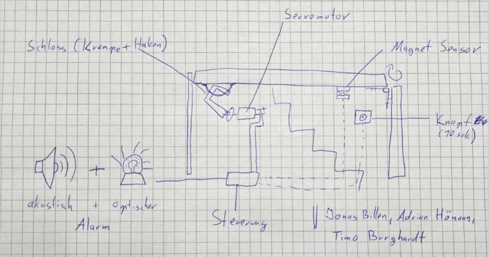
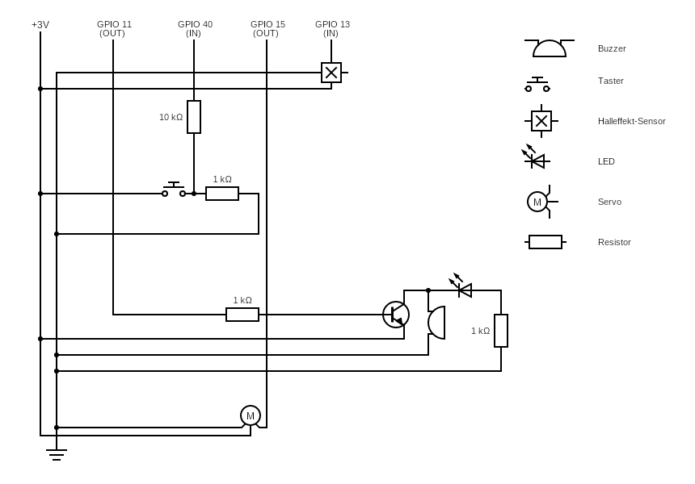
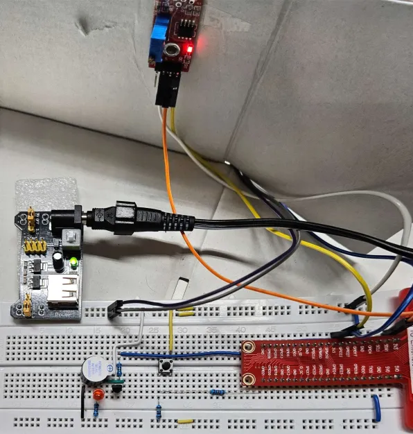

# Projekt Dachluke

## Ausführung

In einem Terminal Emulator `./main.py` ausführen. Mit `Strg-C` können sie das Programm stoppen.

## Abhängigkeiten 

Liste on benötigten Libraries:

* RPi.GPIO 
* time(Builtin)
* datetime(Builtin)

Installation von Abhängigkeiten:

**Mit pip**

```
$ pip install RPi.GPIO
```

oder

**Mit pipx**
```
$ pipx install RPi.GPIO
```

oder

**Mit apt**
```
$ sudo apt install rpi.gpio
```

## Prozess

### Schritt 1: Skizze der geplanten Box

Um das Projekt zu beginnen, haben wir eine Skizze unserer geplanten Box erstellt. Diese Skizze diente als Grundlage für das Design und half uns dabei, die Platzierung der Komponenten sowie die Größe der Box zu bestimmen.

Die Skizze beinhaltet die Positionen für den Servomotor (welche später angepasst wurde), den Buzzer, den Magnet-Sensor, den Taster und die LED. Sie ermöglichte es uns, eine klare Vorstellung von der äußeren Erscheinung der Box zu erhalten und half bei der Planung des Zusammenbaus.


 
### Schritt 2: Vorbereitung

Im Vorbereitungsprozess haben wir jeden der Sensoren (Magnet-Sensor, Servomotor, LED, Buzzer, Taster) einzeln getestet und zum Laufen gebracht. Dies wurde durch die Entwicklung separater Programmcodes für jeden Sensor erreicht. Hier sind die durchgeführten Tests:

Magnet-Sensor:
* Ein Testprogramm wurde entwickelt, um sicherzustellen, dass der Magnet-Sensor ordnungsgemäß auf Änderungen im Magnetfeld reagiert.
* Die Funktionalität des Sensors wurde überprüft, um sicherzustellen, dass er zuverlässig den Zustand der Box (offen/geschlossen) erkennen kann.

Servomotor:
* Ein separater Code wurde geschrieben, um den Servomotor zu testen und sicherzustellen, dass er sich ordnungsgemäß dreht.
* Die Kalibrierung des Servomotors wurde durchgeführt, um die Verriegelungs* und Entriegelungspositionen festzulegen.

LED, Buzzer:
* Programme wurden entwickelt, um die LED, den Buzzer und den Taster separat zu testen und ihre ordnungsgemäße Funktionalität zu überprüfen.
* Außerdem werden beide Komponenten im Zusammenspiel für den optischen und akustischen Alarm verantwortlich sein.

Taster:
* Ein spezielles Programm wurde entwickelt, um den Taster zu testen und sicherzustellen, dass er auf Tastendruck reagiert.
* Die Funktionalität des Tasters wurde überprüft, um sicherzustellen, dass er zuverlässig verwendet werden kann, um den Alarm für die Öffnung der Dachluke temporär zu deaktivieren.

### Schritt 3: Entwicklung des Hauptprogramms

Im Hauptprogramm wurden die einzelnen Testcodes zusammengeführt und Funktionen für die verschiedenen Abläufe der Box gebildet. Dieses Hauptprogramm wurde entwickelt, um die gesamte Logik der Box zu steuern und zu koordinieren. Die folgenden Schritte wurden durchgeführt:

* Integration der einzelnen Programmcodes für die Sensoren und Aktoren.
* Bildung von Funktionen für die verschiedenen Abläufe, wie z.B. das Verriegeln und Entriegeln der Box abhängig von der Uhrzeit, das Auslösen eines Alarms und das Überprüfen des Status von Taster und Magnet-Sensor.
* Parallele Tests wurden durchgeführt, um sicherzustellen, dass das Hauptprogramm reibungslos und zuverlässig funktioniert.

Das Hauptprogramm ist so strukturiert, dass es kontinuierlich läuft und die verschiedenen Sensoren überwacht. Bei Bedarf werden entsprechende Aktionen ausgeführt, wie das Auslösen eines Alarms, das Verriegeln oder Entriegeln der Box, basierend auf den erfassten Daten der Sensoren. Sobald der Alarm einmal ausgelöst wird, muss dieser in der Theorie durch externe Eingriffe deaktiviert werden.
In Realität kann dies durch ein Sicherheitsdienst geschehen und bei uns durch den Abbruch des Programms.
Durch die Zusammenführung der einzelnen Tests und die Entwicklung des Hauptprogramms haben wir eine voll funktionsfähige Smarte Box geschaffen, die in der Lage ist, ihren Zustand zu überwachen und entsprechend zu reagieren.


## Schaltplan



## Projekt Bilder



## Code

```
#!/usr/bin/env python3
import RPi.GPIO as GPIO
import time, datetime

# Pins
servo_pin = 15 # Board Pin für den Servo
buzzer_pin = 11 # Board Pin für den Buzzer
input_magnet = 13 # Board Pin für den Magnet-Sensor
input_button = 40 # Board Pin für den Knopf

GPIO.setmode(GPIO.BOARD)# Numern der GPIO Pins auf BOARD definieren
GPIO.setup(servo_pin, GPIO.OUT) # Setzt servo_pin als Ausgang
GPIO.setup(buzzer_pin, GPIO.OUT) # Setzt buzzer_pin als Ausgange
GPIO.output(buzzer_pin, GPIO.HIGH) # Setzt buzzer_pin high(+3.3V) um den buzzer auszuschalten
GPIO.setup(input_magnet, GPIO.IN) # Setzt input_magnet als Eingang
GPIO.setup(input_button, GPIO.IN) # Setzt input_button als Eingang
pwm = GPIO.PWM(servo_pin, 50) # Setzt Herz Zahl für den servo_pin  
pwm.start(0) # Startet PWM für den servo_pin

global button_status # Globale Variable button_status 
global magnet_status # Globale Variable magnet_status

def servo_lock():
    pwm.ChangeDutyCycle(11.5) # Servo rotieren zum verriegeln 
    time.sleep(.1)
    
def servo_unlock():
    pwm.ChangeDutyCycle(6) # Servo rotieren zum entriegeln
    time.sleep(.1)
	
def alarm():
    while True: # Lässt den Buzzer laufen bis interupt
        GPIO.output(buzzer_pin, GPIO.LOW) # Buzzer auf An gesetzt
        time.sleep(0.1)
        GPIO.output(buzzer_pin, GPIO.HIGH) # Buzzer auf Aus gesetzt
        time.sleep(0.1)

def button_press():
    global button_status
    if (GPIO.input(input_button) == True): # Wenn der input_button stromlos ist
        button_status = 1 # button_status auf 1 gesetzt
    else:  # Wenn der input_button Strom hat
        button_status = 0 # button-status auf 0 gesetzt
        time.sleep(10) # Warten wen Knopf gedrückt ist
        print("Knopf gedrückt")
    return button_status

def magnet():
    global magnet_status 
    if (GPIO.input(input_magnet) == True): # Wenn der input_magnet stromlos ist
        magnet_status = 0 # magnet_status auf 0 gesetzt
        print("Nicht Offen")
    else: # Wenn der input_magnet Strom hat
        magnet_status = 1 # magnet_status auf 0 gesetzt
        print("Offen")
    return magnet_status
    
def main():
    while True:
        if (datetime.datetime.now().strftime("%M") == "19"): # Wenn eine Gewisse Uhrzeit zurückgegeben ist und gleich dem Wert ist 
            servo_lock() # Servo verriegeln
            print("Verschlossen")
        elif (datetime.datetime.now().strftime("%M") == "20"): # Wenn eine Gewisse Uhrzeit zurückgegeben ist und gleich dem Wert ist
            servo_unlock() # Servo entriegeln
            print("Nicht Verschlossen")
        button_press() # Status Prüfung von input_button
        magnet() # Status Prüfung von input_magnet
        if button_status == 1 and magnet_status == 1: # Wenn der Status von button_status und magnet_status beide gleich 1 ist (der input_button wurde nicht gedruckt und der input_magnet ist nicht aktiv)  
            print("Alarm ausgelöst") 
            alarm() # Alarm Auslösen
        else: # Ansonsten sicher
            print("Sicher")
        
    
def destroy():
    GPIO.output(buzzer_pin, GPIO.HIGH) # Buzzer aus machen
    GPIO.cleanup() # GPIO freigeben für neue Prozesse

if __name__ == '__main__':     # Programmstart ab hier
    print("Drücken Sie Ctrl+C um das Programm zu beenden...")
    
    try: # Versuche main auszuführen 
        main()
    except KeyboardInterrupt:  # Wenn 'Ctrl+C' gedrückt wird
        destroy()
```

